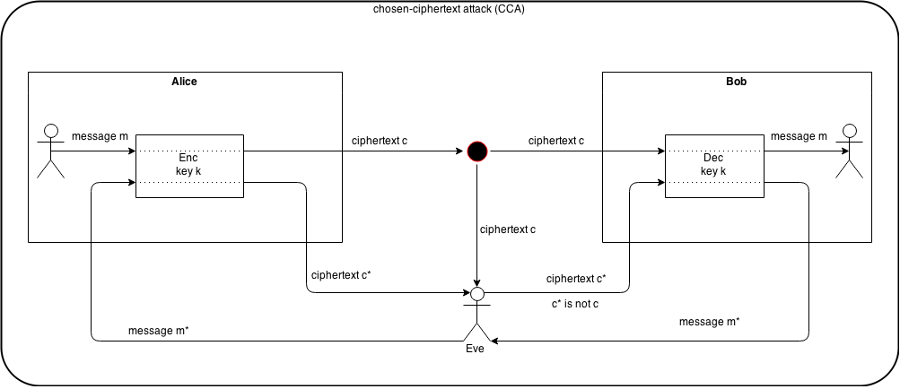

# cryptography

### algorithm

  * classic
    * caesar cipher
    * shift cipher
    * vigenere cipher
  * modern
    * symmetric (secret-key)
      * encryption schemes
        * stream cipher
        * block cipher
          * substitution-permutation-networks
            * S-boxes
            * P-Boxes
          * feistel-networks
          * modes of operation
            * electronic codebook mode (ECB)
              * watermarking attacks
            * cipher-block chaining (CBC)
              * padding oracle on downgraded legacy encryption (POODLE)
            * output-feedback (OFB)
            * counter mode (CTR)
            * eXtended text stealing (XTS)
        * hash functions
          * Merkle-Damgard transform
        * message authentication Codes (MAC)
          * CBC-MAC
          * NMAC (?)
          * HMAC
      * asymmetric (public-key)
        * factorization
          * RSA
        * discrete-log
          * Diffie-Hellman (DH)
          * ElGamal
          * digital signature algorithm (DSA)

### concepts

  * one-way functions (?)
  * CF (?!)
  * pseudo-random generators (PRG)
  * pseudo-random functions (PRF)
  * pseudo-random permutations (PRP)
  * oracle

### theoretic cryptographic attacks

  * encryption schemes
    * eavesdropping (EAV)
    * known-plaintext attack (KPA)
    * chosen-plaintext attack (CPA, für Pubk equiv. zu EAV)
    * chosen-ciphertext attack 1 (CCA1)
    * chosen-ciphertext attack 2 (CCA2)
  * MAC/signature schemes
    * adaptive-chosen-message attack (ACMA)

### attack methods

  * brute-force method
  * frequency analysis
  * Kasiski-test
  * Friedman-test
  * differential cryptanalysis
  * rainbow tables

### number theory

  * modular arithmetic
  * modular exponentiation (square-and-multiply algorithm)
  * groups
  * extended Euclidean algorithm
  * Chinese remainder theorem
  * discrete logarithm

# Figures

### eavesdropping (EAV)

### known-plaintext attack (KPA)

### chosen-plaintext attack (CPA)

### chosen-ciphertext attack (CCA)

